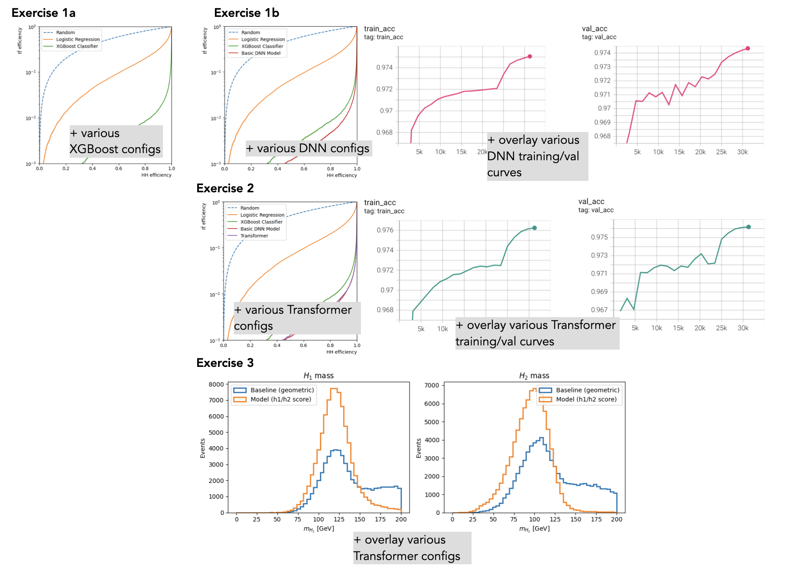

Each session includes several exercises. Please paste your plots onto a single slide - an example is provided below.

Upload your screenshots via [this link](https://cernbox.cern.ch/s/k38RGIHDeErtjQz). At the end of the DAS, we will compile and share everyone's results.

Have fun with the models!